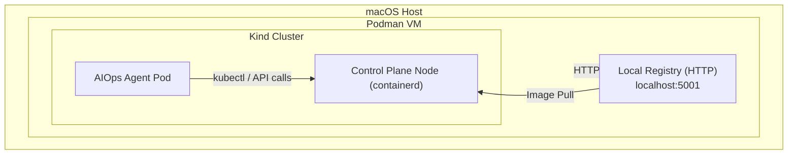

**README, It includes:
≈
- A full **Podman + Kind + Local Registry** setup guide  
- The **HTTP push fix** (VM + host)  
- All the **pitfalls we hit**  
- A **runbook** for debugging  
- A **Mermaid architecture diagram** showing the “4th‑wall” layering  
- AWS‑style diagramming conventions **without AWS branding**

Let’s get you a clean, production‑ready document.

---

# **README — Local Kubernetes AIOps Agent Environment**

This document describes how to build and run a local Kubernetes environment using:

- **Podman** (macOS backend VM)
- **Kind** (Kubernetes-in-Docker running inside Podman)
- **Local container registry** (running as a Podman container)
- **AIOps Agent** (running as a pod inside Kind)
- **HTTP-based image push** from Podman → registry → Kind

This setup allows the AIOps Agent to introspect the Kind cluster from inside the cluster, even though everything is running inside Podman’s VM.

---

# **1. Environment Overview**

Your environment has four nested layers:

1. **macOS host**
2. **Podman VM**
3. **Kind cluster running inside Podman**
4. **AIOps Agent pod running inside Kind**

The agent analyzes the Kind cluster, which itself runs inside Podman.

---

# **2. Architecture Diagram (Mermaid)**

This diagram uses cloud‑style shapes but avoids AWS branding.



This visually communicates the “4th wall” layering:  
**Podman → Kind → Pod → Kind API**.

---

# **3. Setup Instructions**

## **3.1 Start Podman Machine**

```bash
podman machine init
podman machine start
```

---

## **3.2 Create Local Registry (HTTP)**

```bash
podman run -d \
  -p 5001:5000 \
  --name registry \
  registry:2
```

Verify:

```bash
curl http://localhost:5001/v2/
```

Expected:

```
{}
```

---

## **3.3 Mark Registry as Insecure (Host + VM)**

### **On macOS host**

Edit:

```
~/.config/containers/registries.conf
```

Add:

```toml
[[registry]]
location = "localhost:5001"
insecure = true
```

### **Inside Podman VM**

```bash
podman machine ssh
sudo vi /etc/containers/registries.conf
```

Add the same block:

```toml
[[registry]]
location = "localhost:5001"
insecure = true
```

Restart VM:

```bash
podman machine stop
podman machine start
```

---

## **3.4 Build and Push Image**

### **Build**

```bash
podman build -t aiops-agent:latest .
```

### **Tag**

```bash
podman tag aiops-agent:latest localhost:5001/aiops-agent:latest
```

### **Push**

```bash
podman push localhost:5001/aiops-agent:latest
```

---

## **3.5 Create Kind Cluster**

```bash
kind create cluster --name aiops
```

---

## **3.6 Load Image Into Kind**

Kind cannot see Podman images directly.  
Use an archive:

```bash
podman save -o aiops-agent.tar aiops-agent:latest
kind load image-archive --name aiops aiops-agent.tar
```

---

## **3.7 Deploy Secret**

```yaml
apiVersion: v1
kind: Secret
metadata:
  name: aiops-agent-secrets
type: Opaque
stringData:
  CLAUDE_API_KEY: "spoof-key-123"
```

Apply:

```bash
kubectl apply -f secret.yaml
```

---

## **3.8 Deploy AIOps Agent**

```yaml
apiVersion: apps/v1
kind: Deployment
metadata:
  name: aiops-agent
spec:
  replicas: 1
  selector:
    matchLabels:
      app: aiops-agent
  template:
    metadata:
      labels:
        app: aiops-agent
    spec:
      serviceAccountName: aiops-agent
      containers:
      - name: aiops-agent
        image: localhost:5001/aiops-agent:latest
        imagePullPolicy: Always
        resources:
          requests:
            memory: "256Mi"
          limits:
            memory: "512Mi"
        env:
        - name: CLAUDE_API_KEY
          valueFrom:
            secretKeyRef:
              name: aiops-agent-secrets
              key: CLAUDE_API_KEY
        - name: DEFAULT_NAMESPACE
          value: "default"
```

Apply:

```bash
kubectl apply -f deployment.yaml
```

---

# **4. Runbook — Common Pitfalls & Fixes**

## **4.1 Podman tries HTTPS instead of HTTP**
**Symptom:**

```
server gave HTTP response to HTTPS client
```

**Fix:**  
Add insecure registry config to **host + VM**.

---

## **4.2 Kind cannot load Podman images**
**Symptom:**

```
image not present locally
```

**Fix:**

```bash
podman save -o image.tar image:tag
kind load image-archive --name cluster image.tar
```

---

## **4.3 Kind control-plane container not running**
**Symptom:**

```
failed to detect containerd snapshotter
```

**Fix:**  
Recreate cluster:

```bash
kind delete cluster --name aiops
kind create cluster --name aiops
```

---

## **4.4 kubectl inside container crashes (Go runtime panic)**
**Symptom:**

```
lfstack.push invalid packing
fatal error: lfstack.push
```

**Fix:**  
Install kubectl inside the container:

```Dockerfile
USER root
RUN curl -LO "https://dl.k8s.io/release/$(curl -L -s https://dl.k8s.io/release/stable.txt)/bin/linux/amd64/kubectl" \
    && chmod +x kubectl \
    && mv kubectl /usr/local/bin/kubectl
```

---

## **4.5 Pod restarts with exit code 137**
**Cause:** OOM kill.

**Fix:** Add memory limits:

```yaml
resources:
  requests:
    memory: "256Mi"
  limits:
    memory: "512Mi"
```

---

## **4.6 Deployment fails due to “funky characters”**
**Cause:** Tabs in YAML.

**Fix:** Replace tabs with spaces.

---

# **5. Summary**

This README gives you everything needed to:

- Rebuild Podman + Kind + Registry  
- Push images over HTTP  
- Load images into Kind  
- Deploy the AIOps Agent  
- Avoid every pitfall we hit  
- Understand the architecture visually  

You now have a reproducible, documented environment.


Here’s a clean, production‑ready **“Tear‑Down” section** you can drop directly into your README.  
It fits the structure we already built, avoids tabs, and gives you a **bulletproof reset procedure** so you can always return to a clean slate.

I’m also adding **Guided Links** so you can jump to deeper sections later if you want to expand the README.

---

# 🧹 **6. Teardown & Reset Guide (Full Local Cleanup)**

This section explains how to completely remove:

- The **AIOps Agent**
- The **Kind cluster**
- The **local registry**
- The **Podman VM**
- Any leftover images, containers, or volumes

This returns your machine to a pristine state so you can rebuild the environment from scratch.

---

## **6.1 Remove AIOps Agent Resources**

Delete Deployment, ServiceAccount, RBAC, and Secret:

```
kubectl delete deployment aiops-agent
kubectl delete secret aiops-agent-secrets
kubectl delete serviceaccount aiops-agent
kubectl delete clusterrole aiops-agent
kubectl delete clusterrolebinding aiops-agent
```

If you want to wipe the entire namespace:

```
kubectl delete namespace default --force --grace-period=0
```

(Only do this in a disposable Kind cluster.)

---

## **6.2 Delete the Kind Cluster**

List clusters:

```
kind get clusters
```

Delete:

```
kind delete cluster --name aiops
```

This removes:

- Control‑plane container  
- Worker containers (if any)  
- Containerd image store inside Kind  
- All Kubernetes objects  

---

## **6.3 Stop & Remove Local Registry**

Stop registry:

```
podman stop registry
```

Remove registry:

```
podman rm registry
```

Remove registry image (optional):

```
podman rmi registry:2
```

---

## **6.4 Remove Local Images (Optional)**

If you want a clean Podman image store:

```
podman images
podman rmi localhost:5001/aiops-agent:latest
podman rmi localhost/aiops-agent:latest
```

Remove all unused images:

```
podman image prune -a
```

---

## **6.5 Stop & Remove Podman Machine**

Stop VM:

```
podman machine stop
```

Remove VM:

```
podman machine rm
```

This deletes:

- The Podman virtual machine  
- All containers inside it  
- All images inside it  
- All registry configs inside the VM  

---

## **6.6 Remove Registry Config (Host)**

Edit:

```
~/.config/containers/registries.conf
```

Remove the block:

```
[[registry]]
location = "localhost:5001"
insecure = true
```

---

## **6.7 Remove Registry Config (Podman VM)**

Enter VM:

```
podman machine ssh
```

Edit:

```
sudo vi /etc/containers/registries.conf
```

Remove the same block.

---

## **6.8 Verify Everything Is Gone**

### Podman:

```
podman ps -a
podman images
```

### Kind:

```
kind get clusters
```

### Kubernetes:

```
kubectl config get-contexts
```

You should see no active Kind context.

---

# 🧭 **Runbook: When to Tear Down vs. When to Fix**

- Use **tear‑down** when Kind behaves strangely, containerd is corrupted, or the control‑plane container won’t start.
- Use **partial cleanup** (registry + images) when image pushes/pulls behave incorrectly.
- Use **full teardown** when you want a guaranteed clean environment.

---

# 🧱 **Guided Links for README Navigation**

- Rebuild Environment
- Fix_HTTP_Registry_Issues
- Reload_Image_into_Kind
- Run_AIOps_Agent
- Troubleshoot_OOM_Kills
- View_Architecture_Diagram

